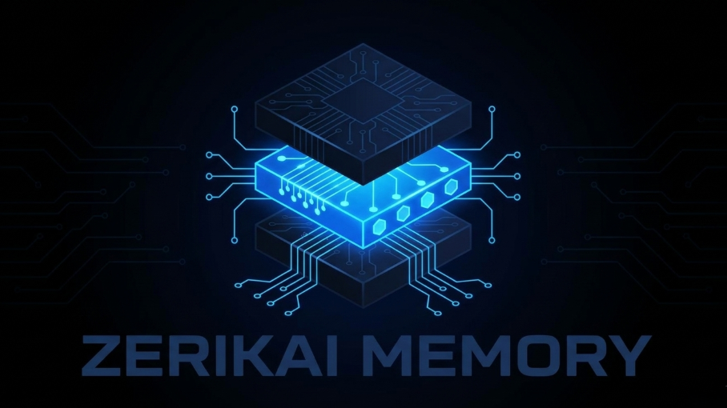

## zerikai_memory 🧠

<p align="center">
⭐ <strong>Bookmark the project:</strong> If you use this tool, drop a star to save it to your GitHub profile and track new performance updates.
</p>

<p align="center">
  
</p>

<p align="center">
  <strong>Never lose your AI context again.</strong><br/>
zerikai_memory provides persistent, workspace-isolated memory for every IDE that is local-first, cost-aware, and instant. It uses deterministic Tree-Sitter code parsing indexing to capture entities and deep code descriptions like functions, classes, and docstrings into a local ChromaDB vector store. Accessed via a local MCP interface to slash token costs while maintaining high-resolution codebase mapping, it retrieves hyper-relevant context on query through L2 and Lexical re-indexing with strict source verification (Entity, File, Line Number, and L2). Designed to pair perfectly with low-cost DeepSeek APIs, it injects structured, highly precise local context instead of dumping raw, massive files, maximizing KV cache hits to radically reduce your active token costs.
</p>

<p align="center">
  
  
  
  
  
  <br>
  
  <br><br>
  
  
  
</p>

<p align="center">
💡<strong>Status: Active & Self-Contained.</strong><br/>
This project is used daily and actively maintained by the author. Pull Requests and Issues are closed to keep maintenance overhead low. It is provided fully functional and ready for production use.
</p>

---

## The Problem

Every new chat session starts completely cold. When you switch contexts or open a new window:

* Your AI Agent forgets every architectural decision, convention, and stack choice made over hours
* You waste critical tokens and 10–15 minutes re-explaining the codebase setup in every single chat
* Large raw file dumps inflate your token costs and shrink your available context window instantly
* Switching IDEs (e.g., VS Code to Cursor) forces you to restart your conversation history from scratch

## How Zerikai Memory Solves It

Zerikai Memory runs as a **local STDIO MCP server** between your IDE and your LLM. It parses your codebase using tree-sitter, indexes code entities into a local ChromaDB vector store, and injects highly relevant context snippets dynamically through natural language.

```
Your Codebase  →  tree-sitter (local parse)  →  ChromaDB (.brain/)
                                                      │
Your IDE       →  MCP Server (:stdio)        →        ▼
                                             Ollama / DeepSeek
                    │                      (auto-routed synthesis)
          ┌─────────┴──────────────┐
          │   4-Stage Pipeline     │
          │   L1  Vector Search    │  ChromaDB L2 distance matching
          │   L2  Lexical Re-rank  │  Keyword overlap boost on names
          │   L3  Auto-Routing     │  Ollama (free) vs. DeepSeek Cloud
          │   L4  LLM Synthesis    │  Answer + inline #file:line citations
          └────────────────────────┘
```

---

## Architecture

### Cost Model — The Context Tax Mitigation

| What gets taxed | Without Zerikai | With Zerikai |
| --- | --- | --- |
| 🔴 **Monthly quota** | Re-explaining stack, decisions, and conventions every session | Indexed once. Retrieved as compact snippets per query. |
| 🟡 **Context window** | Raw file dumps shrink the window available for code generation | 1,000–1,200 token brief prefix*. Window stays wide open.  |
| ⚪ **IDE switching** | Full re-explanation required in every new tool | Shared zerikai_memory workspace `.brain/` directory.  |

> **Tip:** The project brief acts as a stable prefix. After your first query, *DeepSeek caches it, making subsequent repeated queries **up to 50× cheaper**.

---

## Quick Start

I have added a YouTube video walkthrough of the installation and setup process in the first step below. If you prefer text instructions, just follow along with the code snippets.

### 1. Install

<details>

<summary>Watch the installation video</summary>

Click the image below to watch a step-by-step walkthrough of the installation and setup process:

[](https://www.youtube.com/watch?v=sk8x-nbF0Cs)

</details>

```bash
git clone https://github.com/your-username/zerikai_memory.git
cd zeriakai_memory

# Create and activate a virtual environment (Python 3.11+)
python -m venv venv
source venv/bin/activate  # Windows: .\venv\Scripts\activate

pip install -r requirements.txt

```

### 2. Configure Environment

Remove the `.example` from the `.env.example` file in the root directory and rename it to `.env`:

<details>

<summary>Expand to view .env</summary>

```.env
DEEPSEEK_API_KEY=your_deepseek_key_here

# Memory Mode controls which LLM is used for operations:
# - "cloud": Use DeepSeek for all operations (scan, brief, queries) - highest quality, tracked usage
# - "hybrid": Use Ollama for file scanning, DeepSeek for briefs and escalated queries
# - "local": Use Ollama for everything (free, but lower quality briefs)
MEMORY_MODE=cloud

# Enable token tracking and cost reporting (SQLite database at .brain/token_usage.db)
# Set to "false" to disable tracking
ENABLE_TOKEN_TRACKING=true

# Enable deepseek-v4-pro for complex architectural queries (design, architecture, tradeoffs)
# v4-pro is 3x more expensive than v4-flash (currently $0.435/M vs $0.14/M input)
# After May 31 2026, v4-pro will be 6x more expensive ($1.74/M vs $0.14/M)
# Recommended: keep this "false" unless you need maximum reasoning capability
ENABLE_DEEPSEEK_PRO=false

# Semantic search relevance cutoff for query_memory (L2 distance).
# Lower = stricter. Watch "best dist=X.XX" in server.log to calibrate.
# Typical: <0.8 strong match, 0.8-1.5 related, >1.5 noise.
QUERY_DISTANCE_THRESHOLD=1.0

# File extensions to skip during scanning when tree-sitter produces zero
# entities (no functions, classes, headings, semantic HTML elements, etc.).
# Saves API calls on bare config files, trivial templates, empty CSS, etc.
# Format: ['.py', '.html', '.md', '.css']
# Default: [] (empty — no extensions skipped, all fall through to LLM).
SKIP_BARE_FILES=['.py', '.html', '.md', '.css']

# Enable lexical re-ranking in query_memory.
# When true, results passing the distance threshold are reordered by a
# weighted combination of semantic distance and keyword overlap in entity
# name and docstring text. Nothing is dropped — pure reorder.
# Default: false (existing pure-semantic behaviour preserved).
ENABLE_LEXICAL_RERANK=true

# Weight applied per keyword hit during lexical re-ranking.
# The 1/dist spread across the valid-hit band (0.85–0.98) is ~0.156.
# Keep this value below that spread to avoid keyword hits overriding
# a genuinely closer semantic result.
# Recommended starting point: 0.05 (one hit = +0.05, two hits = +0.10).
LEXICAL_RERANK_WEIGHT=0.05
```

</details>

#### 2a. Verify

```bash
python -c "from main import scan_workspace, query_memory; print('OK')"
```

You should see the startup banner followed by `OK`.

### 3. IDE Rule Enforcement

To stop your AI agent from ignoring the memory protocol, copy these directives into your IDE's agent rules profile (e.g., `.cursorrules` or system prompt guidelines):

**IDE Rules in:** [agent_rules/ide_agent_rules.md](agent_rules/ide_agent_rules.md)

* **Universal-Brain First:** The agent *must* query `universal-brain` before attempting raw file searches.
* **Source Discipline:** Every answer *must* surface actual `file.py:line` citations with zero fabrication.

### 4. IDE Registration

1. Press `Ctrl+Shift+P` → **MCP: Add Local Server**
2. Choose **STDIO**
3. Set command: `C:\path\to\zerikai_memory\venv\Scripts\python.exe C:\path\to\zerikai_memory\main.py`

Add to your `claude_desktop_config.json` profile:

```json
{
  "mcpServers": {
    "universal-brain": {
      "command": "C:\\path\\to\\zerikai_memory\\venv\\Scripts\\python.exe",
      "args": ["C:\\path\\to\\zerikai_memory\\main.py"]
    }
  }
}

```

### 5. Setup the `.memignore` file

Works like `.gitignore`: one pattern per line. `scan_workspace` reads this file and skips matching paths.

Each project should have its own `.memignore` in its root directory. Forgetting to configure it before the first scan is the most common reason to use `drop_memory.py` and start fresh:

**Examples of what to ignore:** Expand to view

<details>

<summary>Sample .memignore</summary>

```gitignore
# Directories (trailing slash required)
.git/
node_modules/
venv/
__pycache__/
.brain/
dist/
build/

# File/Folder patterns
**/test/
**/tests/
.env
*.log
*.lock
*.pyc
```

</details>

### 6. Embedding-Docstring Skill

Before running your first index scan, optimize your codebase's docstrings for vector search. Ask your AI Agent:

* To install the embedding-docstring globally in your IDE and run it against your codebase to rewrite docstrings into a more embedding-friendly format.
  * You can find it in the [embedding-docstring skill guide](embedding-docstring/SKILL.md).

> *"Audit and optimize docstrings across this project using the embedding-docstring skill, respecting .memignore."*

| Requirement | Why It Matters | Target Impact |
| --- | --- | --- |
| **Explicit Tech Names** | Use `"Uses Redis"` instead of `"key-value store"` | Embeddings match precise tokens, not abstract concepts. |
| **Routing / Branches** | Document specific route paths and logical pivot options | Ensures structural code matches are surfaceable. |
| **Guarantees & Effects** | Explicitly state code idempotency, atomicity, or mutation side-effects | Prevents agent generation from breaking runtime boundaries. |

### 7. Chat with Memory

Simply instruct your IDE's active AI agent using natural language commands:

prefix queries with **"universal-brain: \<command>"** to ensure they route through the MCP server and leverage your indexed memory:

* Scan the workspace for the first time: `"Set up memory for this project"`
* Ask a question: `"What are the main architectural components of this project?"`

**Frequently used follow-ups:**

* After a code change: `"Rescan the workspace and force a refresh of the project brief."`
* Save part of a chat: `"Save the following context to memory: [your custom notes or constraints here]"`
* Ask how much have you used: `"Get me a cost report for my memory usage so far."`

See below for a full reference of available commands and their descriptions.

---

## MCP Tools Reference

You never run these commands directly; your active AI agent executes them on your behalf.

### Workspace Management

| Tool | Description |
|---|---|
| `init_workspace` | Registers a project folder, assigns a UUID, and creates a pending brief file. Idempotent; safe to run multiple times. |
| `list_workspaces` | Lists all known workspaces that have a brief or stored memories. |
| `resolve_workspace` | Resolves a workspace identifier (UUID, short-UUID, or display name) to its filesystem path. |
| `merge_workspaces` | Consolidates duplicate workspace IDs into one. **Irreversible.** |
| `debug_workspace_id` | Diagnostic tool; shows what workspace ID would be generated from a given path. |

### Memory & Briefs

| Tool | Description |
|---|---|
| `scan_workspace` | Starts a background scan. Returns immediately; use `scan_status` to track progress. Walks the directory, respects `.memignore`, saves all readable text files to persistent memory. Idempotent and self-cleaning. Concurrent (4 workers, batch writes). |
| `scan_status` | Returns progress of a running or recently completed background scan: files scanned, entities indexed, errors, elapsed time, brief status. |
| `save_to_memory` | Manually saves an architectural decision, fact, or technical note with an optional category tag. |
| `list_memory` | Lists stored memories for a workspace, optionally filtered by category. |
| `query_memory` | Retrieves relevant context via vector search and synthesises an answer via Ollama or DeepSeek (auto-routed). Returns a structured JSON result (parsed by the IDE agent) with clickable file links and relevance scores. |
| `get_brief` | Retrieves the current project brief from `.brain/contexts/`. |
| `update_brief` | Manually updates the markdown content of a project brief. |

### Usage & Diagnostics

| Tool | Description |
|---|---|
| `get_token_usage` | Returns DeepSeek API token usage and cost statistics. |
| `get_cost_report` | Generates a cost breakdown by operation type. |
| `get_cache_stats` | Shows cache hit/miss rates by operation type. |
| `purge_usage_data` | Deletes historical token tracking records. |

---

## Project Brief Matrix

When a workspace is scanned, Zerikai compiles a dense **1,000–1,200 token project brief** across 9 locked components:

| Section | What It Captures |
| --- | --- |
| 1. **Overview** | Project domain, primary type, and functional scope. |
| 2. **Technical Stack** | Backend engines, databases, integrations, and core libraries. |
| 3. **Core Architecture** | Interactivity between frontend, backend, and processing layers. |
| 4. **Primary Conventions** | Local code styling, custom error handling, and validation schema rules. |
| 5. **Purpose** | Business logic problems solved and key underlying objectives. |
| 6. **Key Files** | Definitive app entry points, central routers, and specific domain tasks. |
| 7. **Dev & Testing** | Environment installation setups, execution triggers, and testing runs. |
| 8. **Data Flow** | Complete systemic request lifecycle tracing from gateway to database layer. |
| 9. **Future Roadmap** | Planned engineering steps and dangling `TODO` items parsed directly from code. |

---

## Memory Modes

Adjust your operation profile via the `MEMORY_MODE` environment toggle to balance privacy, speed, and API costs:

| Mode | Scan Engine | Query Engine | Total Cost | Ideal Use Case |
| --- | --- | --- | --- | --- |
| 🟢 `cloud` | DeepSeek | DeepSeek | Low | **Recommended.** Maximum context nuance, no local setup. |
| 🟡 `hybrid` | Ollama | Ollama + DeepSeek | Lowest | Tight data governance. Free local lookups with cloud escalation. |
| 🔴 `local` | Ollama | Ollama | **$0.00** | 100% air-gapped offline environment tracking. |

---

## Configuration Reference

| Key | Default | Description |
| --- | --- | --- |
| `DEEPSEEK_API_KEY` | *Required* | Active API authorization key from platform.deepseek.com. |
| `MEMORY_MODE` | `cloud` | Sets target engines: choices include `cloud`, `hybrid`, or `local`. |
| `ENABLE_TOKEN_TRACKING` | `true` | Calculates continuous usage and outputs summaries to SQLite. |
| `QUERY_DISTANCE_THRESHOLD` | `1.0` | Sets L2 vector distance cutoff limits. Lower inputs restrict matches. |
| `ENABLE_LEXICAL_RERANK` | `false` | Activates secondary hybrid reordering layer via keyword matching. |
| `SKIP_BARE_FILES` | `[]` | Extension list to bypass when tree-sitter finds zero valid code entities. |

---

## Auxiliary Scripts & Troubleshooting

### Workspace Reset

If you accidentally execute a workspace crawl before setting up your `.memignore` configurations, run the auxiliary wipe script to delete stale workspace data:

```bash
# Windows
.\venv\Scripts\python.exe drop_memory.py "Workspace Name"

# macOS / Linux
venv/bin/python drop_memory.py "Workspace Name"

```

### Live Log Diagnostics

Monitor server activity, runtime operations, and auto-routing logs inside **`.brain/server.log`**:

```bash
# Live stream logs (macOS/Linux)
tail -f .brain/server.log

# Live stream logs (Windows PowerShell)
Get-Content .brain\server.log -Wait -Tail 30

```

---

## Security & Data Privacy

* All active vector spaces, tracking registries, and context details reside directly on your local machine.
* Add `.env` and `.brain/` explicitly to your global or project `.gitignore` patterns to prevent API keys and secure indexes from leaking to version control platforms.

---

To read more about the underlying design principles, architecture decisions, and future roadmap for Zerikai Memory, check out the [insight article](https://zerikai.com/blog/reduce-ai-ide-token-costs-with-zerikai-memory.html).

## License

MIT License © [Zerikai](http://zerikai.com)

<p align="center">
🛠️ <strong>Support:</strong> This project is provided as-is for personal use. To prevent automated spam and AI-generated noise, direct email and issue tracking are disabled. For questions, please use the AI assistant zerikai.com I will get the message and get back to you, don't forget to leave a way to contact you.
</p>
