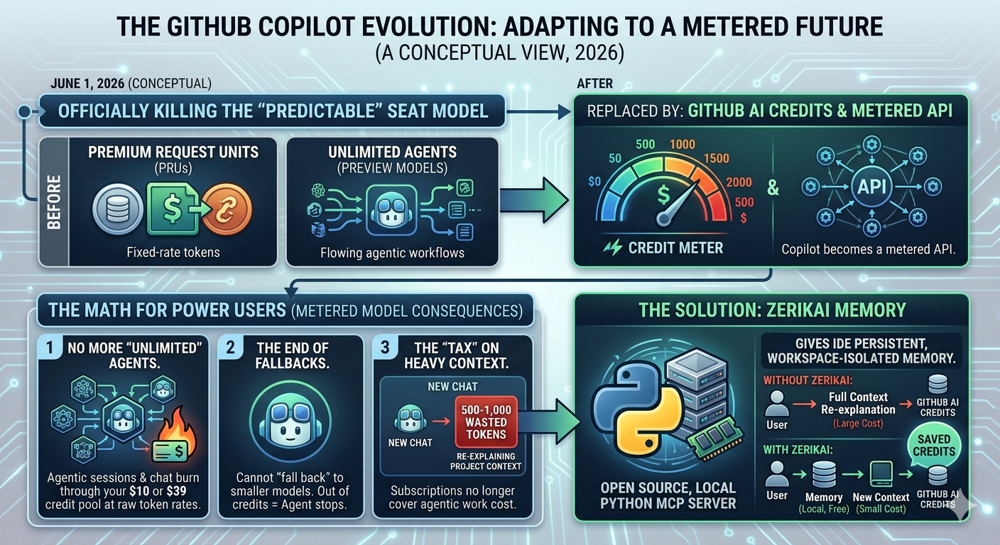

# Zerikai Memory

A standalone local-only Python MCP server that gives any IDE persistent, workspace-isolated memory. Combines ChromaDB (local vector store), Ollama (free local summarisation), and DeepSeek (cloud synthesis) with automatic cost-aware routing.



---

## Table of Contents

1. [What Is Zerikai Memory?](#what-is-zerikai-memory)
2. [How It Works](#how-it-works)
3. [Cost Savings Explained](#cost-savings-explained)
4. [Project Structure](#project-structure)
5. [Prerequisites](#prerequisites)
6. **[Installation](#installation)** *
7. [IDE Registration](#ide-registration)
8. [Workspace Setup (per project)](#workspace-setup-per-project)
9. [Day-to-Day Usage](#day-to-day-usage)
10. [Auto-Routing Reference](#auto-routing-reference)
11. [Project Brief Structure](#project-brief-structure)
12. [MCP Tools Reference](#mcp-tools-reference)
13. [Monitoring & Logs](#monitoring--logs)
14. [Auxiliary Scripts](#auxiliary-scripts)
15. [Embedding-Docstring Skill](#embedding-docstring-skill)
16. [DeepSeek KV Cache Optimisation](#deepseek-kv-cache-optimisation)
17. [Security & Data Privacy](#security--data-privacy)
18. [Troubleshooting](#troubleshooting)
19. [Notice](#notice)

---

## What Is Zerikai Memory?

Zerikai Memory is a **local MCP (Model Context Protocol) server** that provides persistent, workspace-isolated memory to your IDE's AI assistant. It solves a core problem with AI-assisted development: every new chat session starts cold, forcing you to re-explain your project context, decisions, and conventions, wasting tokens and time.

By storing compressed, semantically searchable summaries of your codebase and architectural decisions, Zerikai Memory enables your IDE's AI to:

- **Recall decisions** made in previous sessions instantly.
- **Understand your codebase** without raw file dumps into the chat window.
- **Share context across IDEs**, work in VS Code, then switch to Cursor, with no re-explanation.
- **Dramatically reduce API costs** through smart local/cloud routing and DeepSeek KV caching.

The server runs **entirely on your local machine**. Each IDE connects via STDIO to its own server process, with direct filesystem access for workspace scanning.

---

### New Updates 2026-05-13

- **Lexical re-ranking in `query_memory`:** New hybrid search step: after semantic retrieval, results are reordered by keyword overlap in entity names and docstrings. Solves false positives where functions with shared vocabulary (e.g. "tree-sitter", "extract") crowd out the correct match. `ENABLE_LEXICAL_RERANK=true` activates it; `LEXICAL_RERANK_WEIGHT` (default 0.05) controls boost per keyword hit. Pure reorder, nothing dropped. Default off.
- **Agent-aware tool descriptions:** All 15 MCP tool docstrings reviewed and tuned for AI agent consumption (Copilot, Claude Desktop, Antigravity). Agents now receive priority directives, anti-pattern hints, and "when not to use" guidance directly in the tool schema, reducing trial-and-error probing.
- **`save_to_memory` docstring rewritten:** Leads with use-case semantics (*"Manually save an architectural decision, fact, or technical note"*) instead of implementation details. Adds explicit routing hint: *"it's not for code files, `scan_workspace` handles those."*
- **Priority directives now explicit:** `get_brief` says *"Use this FIRST on any new workspace."* `query_memory` says *"Use this BEFORE reasoning from priors."* `list_memory` warns *"not to answer code questions, use `query_memory`."* `resolve_workspace` identifies itself as *"a helper tool for agents that don't have filesystem context."*
- **Irreversible operations flagged:** `merge_workspaces` and `purge_usage_data` both carry a *"Cannot be undone"* warning visible to the agent before execution.

### New Updates 2026-05-12

- **Parallel brief synthesis:** All 9 brief sections now fire simultaneously via `asyncio.gather`. Brief generation dropped *from ~90 seconds to ~20-30 seconds*.
- Skip bare `.py` files: New `SKIP_BARE_PY_FILES` toggle in `.env`. Skips `.py` files with no functions or classes (`admin.py`, `urls.py`, `settings.py`) to avoid DeepSeek calls on boilerplate.
 Default off.
- **HTML comment indexing:** _extract_html now captures `<!-- -->` comments as docstrings for the elements that follow. Comments are searchable and appear in the Sources table.
- **Embedding-docstring skill:** Updated to cover HTML comments in addition to *Python*, *JavaScript*, and *TypeScript* docstrings.
- **Brief timing corrected:** Status messages updated from "about 90 seconds" to "about 20 seconds."
- **Primary Conventions prompt tightened:** Briefs no longer include filler sections like Naming Conventions or Testing infrastructure.
- **use_cloud default:** `synthesize_deep_brief` now defaults to cloud mode.

### Update - 2026-05-11

- **Sources table**: Every `query_memory` response prepends a `## Sources` Markdown table with entity name, file, line, and semantic distance.
- **Full docstrings embedded**: `_clean_docstring` no longer truncates to first sentence; the LLM sees complete function descriptions for richer answers.
- **`show_sources` toggle**: Callers can enable or disable the Sources table per query; defaults to on.
- **Fire-and-forget brief synthesis**: `scan_workspace` returns immediately; brief generates in background, no more MCP timeouts.
- **Tighter distance threshold**: Default `QUERY_DISTANCE_THRESHOLD=1.0` in `.env`, eliminating false positives.
- **Embedding-docstring skill**: A companion skill (`skill/embedding-docstring.md`) that audits docstrings for embedding quality: technology naming, routing documentation, guarantees, and size limits.

---

## How It Works

```
Your IDE  ──►  MCP Server (main.py)  ──►  ChromaDB (.brain/vector_db/)
                     │                         ↑ semantic retrieval
                     ├── Ollama (local)    ─── Used in Hybrid & Local modes
                     └── DeepSeek (cloud)  ─── Used in Hybrid & Cloud modes
```

When you ask your AI assistant a question:

1. The MCP server receives the query.
2. It performs a **vector search** against ChromaDB to retrieve the most relevant entities (function signatures, docstrings, file summaries) from your codebase.
3. The auto-router decides whether to send the query to **Ollama** (local, free) or **DeepSeek** (cloud, billed).
4. The synthesised answer is returned to your IDE ; enriched with workspace context, without bloating your chat window.

You never call MCP tools directly. You speak to your AI assistant in natural language and it calls the tools on your behalf.

### Workspace Identity

You do not specify your project name or path in chat. Your IDE automatically attaches metadata about your currently active workspace to every message. The server maintains a **Workspace Registry** (SQLite) that maps each workspace folder to a persistent UUID and human-friendly display name.

The AI assistant can resolve any workspace identifier: UUID, short-UUID, or display name, so you never pass raw file paths for routine queries.

---

## Cost Savings Explained

DeepSeek is invoked in three places: query synthesis (when auto-routed for long or architectural queries), brief synthesis (9 section calls totalling ~ \$0.003 per full regeneration), and file scanning when in cloud mode (~ \$0.000167 per file). In hybrid mode, routine queries and file scans run on Ollama at \$0. The Project Brief is a fixed prefix across queries, so DeepSeek caches it at \$0.0028/M tokens (hit) vs \$0.14/M (miss), 50x cheaper after the first query. Code files are parsed locally by tree-sitter at zero API cost regardless of mode. All IDEs share the same .brain/ directory, so context saved in one is instantly available in another with no re-explanation cost. Every query_memory response includes a ## Sources Markdown table with entity name, file, line, and distance. This metadata is already stored during scanning at no extra API cost.

---

## Project Structure

```
zerikai_memory/
├── .brain/                       # Created on first run: do NOT commit
│   ├── server.log                # Rotating log file (5 MB cap, 2 backups)
│   ├── zerikai.db                # SQLite: Workspace Registry & token tracking
│   ├── vector_db/                # ChromaDB: one sub-collection per workspace
│   └── contexts/                 # Per-workspace project briefs (.md files)
├── .env                          # API keys: never commit
├── .memignore                    # Files/dirs excluded from memory indexing
├── code_indexer.py               # Deterministic tree-sitter extraction logic
├── config.py                     # Configuration & routing thresholds
├── drop_memory.py                # Cleanup utility (registry + vectors + files)
├── main.py                       # MCP server entry point
├── requirements.txt
└── skill/                        # Companion skills (embedding-docstring, etc.)
```

---

## Prerequisites

| Dependency | Purpose | Link |
|---|---|---|
| Python 3.11+ | Runtime | [python.org](https://python.org) |
| Ollama | Free local summarisation (hybrid/local modes) | [ollama.com](https://ollama.com) |
| DeepSeek API key | Cloud synthesis (hybrid/cloud modes) | [platform.deepseek.com](https://platform.deepseek.com) |

---

## Installation

### Step 1: Clone and create the virtual environment

```bash
git clone https://github.com/your-username/zerikai_memory.git
cd zerikai_memory

# Python 3.13+
python -3.13 -m venv venv

# Windows
.\venv\Scripts\activate

# macOS / Linux
source venv/bin/activate

pip install -r requirements.txt
```

### Step 2: Configure `.env`

Configure via `MEMORY_MODE` in your `.env` file.

| Mode | LLM Strategy | Best For |
|---|---|---|
| `cloud` | DeepSeek for everything | **Recommended. Cheaper, no Ollama needed, best brief quality.** |
| `hybrid` | Ollama (scans/routine) + DeepSeek (architecture/briefs) | Privacy-sensitive users who want free local lookups |
| `local` | Ollama for everything | 100% privacy & $0 cost, lower quality |

**Recommendation:** Start with `cloud`. You only need a DeepSeek API key -- no Ollama installation, no GPU requirements, no local model management. DeepSeek v4-flash is cheap ($0.14/M input tokens) and brief synthesis runs at ~$0.003 per full regeneration.

**Get a DeepSeek API key at [platform.deepseek.com](https://platform.deepseek.com), then add it to `.env`:**

```.env
DEEPSEEK_API_KEY=your_deepseek_key_here

# Memory Mode controls which LLM is used for operations:
# - "cloud": Use DeepSeek for all operations (scan, brief, queries) - highest quality, tracked usage
# - "hybrid": Use Ollama for file scanning, DeepSeek for briefs and escalated queries
# - "local": Use Ollama for everything (free, but lower quality briefs)
MEMORY_MODE=cloud

# Enable token tracking and cost reporting (SQLite database at .brain/token_usage.db)
# Set to "false" to disable tracking
ENABLE_TOKEN_TRACKING=true

# Enable deepseek-v4-pro for complex architectural queries (design, architecture, tradeoffs)
# v4-pro is 3x more expensive than v4-flash (currently $0.435/M vs $0.14/M input)
# After May 31 2026, v4-pro will be 6x more expensive ($1.74/M vs $0.14/M)
# Recommended: keep this "false" unless you need maximum reasoning capability
ENABLE_DEEPSEEK_PRO=false

# Semantic search relevance cutoff for query_memory (L2 distance).
# Lower = stricter. Watch "best dist=X.XX" in server.log to calibrate.
# Typical: <0.8 strong match, 0.8-1.5 related, >1.5 noise.
QUERY_DISTANCE_THRESHOLD=1.0

# When True, .py files that produce zero tree-sitter entities (no functions or
# classes found) are skipped during scanning instead of sent to DeepSeek for
# LLM summarisation. Saves API calls on files like admin.py, urls.py, settings.py,
# wsgi.py that have only variable assignments and module-level code.
# Default: false (existing behaviour — all such files are LLM-summarised).
# Set to "true" to skip them.
SKIP_BARE_PY_FILES=false

# Enable lexical re-ranking in query_memory.
# When true, results passing the distance threshold are reordered by a
# weighted combination of semantic distance and keyword overlap in entity
# name and docstring text. Nothing is dropped — pure reorder.
# Default: false (existing pure-semantic behaviour preserved).
ENABLE_LEXICAL_RERANK=false

# Weight applied per keyword hit during lexical re-ranking.
# The 1/dist spread across the valid-hit band (0.85–0.98) is ~0.156.
# Keep this value below that spread to avoid keyword hits overriding
# a genuinely closer semantic result.
# Recommended starting point: 0.05 (one hit = +0.05, two hits = +0.10).
LEXICAL_RERANK_WEIGHT=0.05
```

> **Note:** `OLLAMA_HOST` is optional. If your system has `OLLAMA_HOST=0.0.0.0` set (common on server installs), the server corrects it to `http://127.0.0.1:11434` for client connections.

### Step 3: Pull a local Ollama model (hybrid/local mode only)

Download and install [Ollama](https://ollama.com) for your OS. Then pull a model:

> Only required for `MEMORY_MODE=hybrid` or `MEMORY_MODE=local`. Not needed for cloud mode.

### Step 4: Verify the installation

Open a terminal in your project root (virtual environment activated) and run:

```bash
python -c "from main import scan_workspace, query_memory; print('OK')"
```

You should see the server startup banner followed by `OK`.

---

## IDE Registration

The server starts **once** when the IDE loads and stays running. Tool calls are messages to that process, there is no restart per call.

### Google Antigravity

Edit `mcp_config.json` directly:

```json
"universal-brain": {
  "command": "C:\\path\\to\\zerikai_memory\\venv\\Scripts\\python.exe",
  "args": [
    "C:\\path\\to\\zerikai_memory\\main.py"
  ],
  "disabled": false
}
```

> Replace `C:\\path\\to\\zerikai_memory` with the actual absolute path. Double backslashes are required for valid JSON on Windows.

### VS Code (Copilot / Cline)

1. Press `Ctrl+Shift+P` → **MCP: Add Local Server**
2. Choose **STDIO**
3. Set command to: `/path/to/zerikai_memory/venv/bin/python /path/to/zerikai_memory/main.py`

### Cursor

Add to `.cursor/mcp.json`:

```json
{
  "mcpServers": {
    "universal-brain": {
      "command": "/path/to/zerikai_memory/venv/bin/python",
      "args": ["/path/to/zerikai_memory/main.py"]
    }
  }
}
```

### Claude Desktop

**Windows:** `%APPDATA%\Claude\claude_desktop_config.json`
**macOS:** `~/Library/Application Support/Claude/claude_desktop_config.json`

```json
{
  "mcpServers": {
    "universal-brain": {
      "command": "C:\\path\\to\\zerikai_memory\\venv\\Scripts\\python.exe",
      "args": [
        "C:\\path\\to\\zerikai_memory\\main.py"
      ]
    }
  }
}
```

> On macOS/Linux, use forward slashes: `/path/to/zerikai_memory/venv/bin/python`

---

## Workspace Setup (per project)

### 1. Setup the `.memignore` file

Works like `.gitignore`: one pattern per line. `scan_workspace` reads this file and skips matching paths.

Each project should have its own `.memignore` in its root directory. Forgetting to configure it before the first scan is the most common reason to use `drop_memory.py` and start fresh.

```gitignore
# Directories (trailing slash required)
.git/
node_modules/
venv/
__pycache__/
.brain/
dist/
build/

# File/Folder patterns
**/test/
**/tests/
.env
*.log
*.lock
*.pyc
```

### 2. Register a new project

In a new chat session in your IDE, call the universal-brain MCP and ask:

```
"Set up memory for this project"
```

The assistant calls `init_workspace`, which registers the folder and creates a pending brief file at:

```
.brain/contexts/<workspace_id>.md
```

> `init_workspace` is idempotent, running it multiple times is safe and returns the existing registration.

### 3. Scan and index the workspace

Tell your assistant:

```
"Scan and index the workspace."
```

The assistant calls `scan_workspace`. This triggers the **Post-Scan Auto-Briefing**:

1. Walks the directory (respecting `.memignore`). Supported code files are parsed into deterministic `tree-sitter` entities, while other text files get compressed summaries.
2. Performs **iterative synthesis**: queries memory for up to 75 relevant `tree-sitter` nodes/summaries per section across 9 project brief sections.
3. Uses the auto-router (DeepSeek in Hybrid/Cloud modes) to synthesise a complete, accurate **Project Brief**.
4. Saves the brief to `.brain/contexts/<workspace_id>.md` and locks it to protect your DeepSeek KV cache prefix.

> **Cache Stability Policy:** Normal daily scans do **not** regenerate the project brief. The brief is only generated on the first scan or when explicitly forced.

### 4. Force a brief refresh (when needed)

If you make a major architectural pivot, tell your assistant:

```
"Rescan the workspace and force a refresh of the project brief."
```

The assistant calls `scan_workspace(force_refresh_brief=True)`.

---

## Day-to-Day Usage

### Scan

```
"Scan the workspace."
```

`scan_workspace` is **idempotent and self-cleaning**:

- Uses deterministic hashing to overwrite existing file records (no duplicates).
- Automatically **purges stale memories** for files deleted or added to `.memignore` since the last scan.
- Does **not** regenerate the project brief, preserving your KV cache.

### Common natural-language commands

| You say | What happens |
|---|---|
| *"Remember that we're using Redis for session caching"* | `save_to_memory` is called |
| *"What did we decide about auth?"* | `query_memory` → Ollama (local, instant) |
| *"Refactor the data layer, what are our constraints?"* | `query_memory` → DeepSeek (auto-escalated) |
| *"List what's in memory for this project"* | `list_memory` |
| *"What projects do you know about?"* | `list_workspaces` |
| *"Show me the project brief."* | `get_brief` → displays `.brain/contexts/<id>.md` |

### Retrieve the project brief

```
"Show me the project brief."
```

The assistant calls `get_brief`, which reads the `.md` file from `.brain/contexts/` and displays its content. If no brief exists, it suggests running `init_workspace` and `scan_workspace` first.

---

## Auto-Routing Reference

Routing is fully automatic based on query characteristics. You can override it explicitly.

| Condition | Engine | Cost |
|---|---|---|
| Short, specific query | Ollama | Free |
| Query ≥ 40 words | DeepSeek v4-flash | ~\$0.028/M cached tokens |
| Contains architectural keywords (`refactor`, `architect`, `design`, `audit`…) | DeepSeek v4-pro | ~\$0.028/M cached tokens |
| `use_cloud=True` (explicit override) | DeepSeek |: |
| `use_cloud=False` (explicit override) | Ollama | Free |

---

## Project Brief Structure

Each workspace gets an auto-generated project brief optimised for DeepSeek KV caching. The brief is 1,000–1,200 tokens, the sweet spot for cache stability and accuracy.

The brief is synthesised using **DeepSeek v4-flash** (or Ollama in local mode), generating 15 semantic search results per section for accuracy.

### 9-Section Structure

| # | Section | Content |
|---|---|---|
| 1 | **Overview** | High-level summary of type, purpose, and domain |
| 2 | **Technical Stack** | Backend, Database, API integrations, Libraries |
| 3 | **Core Architecture** | Frontend, Backend, Data/Processing layers |
| 4 | **Primary Conventions** | Code, docs, error handling, and schema rules |
| 5 | **Purpose** | Business problem solved and core objectives |
| 6 | **Key Files & Directories** | Entry points and routers with specific purposes |
| 7 | **Development & Testing** | Setup, running, testing, and deployment instructions |
| 8 | **Data Flow & Request Lifecycle** | Request trace from entry point to data layer |
| 9 | **Future Roadmap** | Planned features, improvements, and TODOs from code |

**Benefits:**

- 1,000–1,200 tokens → optimal cache stability.
- 10× cost savings via DeepSeek cache hits (identical prefix across queries).
- Semantic search friendly → accurate context retrieval.
- Human-readable → can be manually reviewed and edited.

---

## MCP Tools Reference

You never call these tools directly, your AI assistant calls them based on your natural language instructions. This reference is for understanding what the server can do.

### Workspace Management

| Tool | Description |
|---|---|
| `init_workspace` | Registers a project folder, assigns a UUID, and creates a pending brief file. Idempotent; safe to run multiple times. |
| `list_workspaces` | Lists all known workspaces that have a brief or stored memories. |
| `resolve_workspace` | Resolves a workspace identifier (UUID, short-UUID, or display name) to its filesystem path. |
| `merge_workspaces` | Consolidates duplicate workspace IDs into one. **Irreversible.** |
| `debug_workspace_id` | Diagnostic tool; shows what workspace ID would be generated from a given path. |

### Memory & Briefs

| Tool | Description |
|---|---|
| `scan_workspace` | Walks the directory, respects `.memignore`, and saves all readable text files to persistent memory. Idempotent and self-cleaning. |
| `save_to_memory` | Manually saves an architectural decision, fact, or technical note with an optional category tag. |
| `list_memory` | Lists stored memories for a workspace, optionally filtered by category. |
| `query_memory` | Retrieves relevant context via vector search and synthesises an answer via Ollama or DeepSeek (auto-routed). Returns a `## Sources` Markdown table with entity name, file, line, and distance. Defaults to on; set `show_sources=False` for clean output. Different agents render the table differently: Claude Desktop may need prompting to show it; after the format was changed to raw Markdown, agents display it directly. Ask "show me the source chart" to surface it. |
| `get_brief` | Retrieves the current project brief from `.brain/contexts/`. |
| `update_brief` | Manually updates the markdown content of a project brief. |

### Usage & Diagnostics

| Tool | Description |
|---|---|
| `get_token_usage` | Returns DeepSeek API token usage and cost statistics. |
| `get_cost_report` | Generates a cost breakdown by operation type. |
| `get_cache_stats` | Shows cache hit/miss rates by operation type. |
| `purge_usage_data` | Deletes historical token tracking records. |

---

## Monitoring & Logs

All server activity is written to **`.brain/server.log`** with a 5 MB rotating cap and 2 rolling backups.

### What is logged

| Event | Level |
|---|---|
| Server startup (DB path, model, mode) | `INFO` |
| Memory saved (workspace, category, preview) | `INFO` |
| Auto-route decision (reason) | `INFO` |
| DeepSeek cache hit / miss stats | `INFO` |
| `scan_workspace`: each file saved or skipped | `INFO` / `DEBUG` |
| Any tool failure | `ERROR` |

### Live tail

```powershell
# Windows PowerShell
Get-Content .brain\server.log -Wait -Tail 30
```

```bash
# macOS / Linux
tail -f .brain/server.log
```

### Filter errors only

```powershell
# Windows PowerShell
Select-String -Path .brain\server.log -Pattern "ERROR"
```

```bash
# macOS / Linux
grep "ERROR" .brain/server.log
```

---

## Auxiliary Scripts

### `drop_memory.py`: Wipe a workspace

Use this when you need to completely reset the AI's memory for a specific project, for example, if you forgot to configure `.memignore` before the first scan and the AI indexed a large `logs/` directory.

The script deletes:

- The ChromaDB vector collection for the workspace.
- The associated `.brain/contexts/<workspace_id>.md` brief file.
- The workspace registry entry in `zerikai.db`.

**Usage:**

```bash
# Windows
.\venv\Scripts\python.exe drop_memory.py "Workspace Name"
# or by UUID
.\venv\Scripts\python.exe drop_memory.py workspace-uuid

# macOS / Linux
venv/bin/python drop_memory.py "Workspace Name"
```

Find workspace names and IDs with `list_workspaces` or by listing `.brain/contexts/`.

After wiping, fix your `.memignore`, then re-run `init_workspace` and `scan_workspace`.

---

## Embedding-Docstring Skill

The embedding-docstring skill (`skill/embedding-docstring.md`) is a companion skill that helps maintain docstring quality across any codebase. It audits functions, methods, and classes for embedding-optimized docstrings that are rich, dense, and keyword-accurate so semantic search retrieves them correctly.

### What it checks

- **Technology names**: If the code imports `redis`, the docstring should say "Redis", not "key-value store". The embedding matches words, not concepts.
- **Routing / branches**: "Uses tree-sitter for code files, falls back to LLM summarization": decision logic must be documented.
- **Guarantees**: Idempotency, atomicity, ordering, or "no guarantees" stated explicitly.
- **Side effects**: What the function writes, calls, or mutates beyond its return value.
- **Size limit**: Prose body above `Args:`/`Returns:` capped at 4 lines or 400 characters, whichever is shorter.

### How to use it

In any workspace, tell your assistant:

```
audit docstrings in api_handler.py using the embedding-docstring skill
```

or for a single function:

```
optimize the docstring for authenticate_user for vector search
```

The skill reads the source, applies the checklist, flags violations with line numbers, and proposes before/after diffs for approval. It works with Python, JavaScript, TypeScript, and any language with docstring conventions.

### Why it exists

Docstrings that are too short, too vague, or missing technology names starve semantic search. The LLM can only synthesize from what's embedded. The skill ensures every docstring carries enough keyword density to be findable.

## DeepSeek KV Cache Optimisation

Caching is **automatic**, no flags required.

The server structures every API call to maximise hit rate:

- **System message** = fixed role instruction + stable project brief. This prefix is identical on every call for the same workspace → cached after the first call of a session.
- **User message** = retrieved context snippets + query. This changes every call → never cached (by design).

A well-populated 600-token project brief means paying **\$0.0028/M tokens** (cache hit) instead of **\$0.14/M** (cache miss) on your largest token block, a **50× saving** on every query after the first, using v4-flash pricing.

> **Cache Protection:** Do not force-refresh the project brief during normal development. The brief is intentionally locked after the first scan to keep the system message prefix identical and cache hits active.

---

## Security & Data Privacy

All memory data and API keys stay on your machine.

### `.gitignore` requirements

```gitignore
.env       # Contains DEEPSEEK_API_KEY
.brain/    # Contains local vector DB and project briefs
```

> **Warning:** Never commit your `.brain/` folder or `.env` file to version control.

### Key security properties

- **Workspace isolation:** Each project gets its own ChromaDB sub-collection, separate SQLite records, and a separate brief file. Queries for one workspace never return data from another.
- **Deterministic hashing:** File records use deterministic IDs, re-scanning overwrites existing records rather than duplicating them.
- **Local-first by default:** In `hybrid` and `local` modes, the majority of operations never leave your machine.

---

## Troubleshooting

### The server fails to start

**Symptoms:** IDE shows MCP connection error; no startup banner in logs.

**Check:**

1. Virtual environment is activated and `pip install -r requirements.txt` completed without errors.
2. `.env` exists with a valid `DEEPSEEK_API_KEY` (even in `local` mode, the file must exist).
3. Python version is 3.11+: `python --version`
4. Path to `main.py` in IDE config uses absolute paths and correct separators for your OS.

---

### Ollama not responding

**Symptoms:** `hybrid` or `local` mode queries fail or time out.

**Check:**

1. Ollama is running: open a browser to `http://127.0.0.1:11434`, you should see a response.
2. The model is pulled: `ollama list` should show `llama3.2` (or your configured model).
3. If your system has `OLLAMA_HOST=0.0.0.0` set as an environment variable, the server corrects this automatically. If issues persist, unset it or set it explicitly to `http://127.0.0.1:11434`.

---

### Memory is stale or contains irrelevant files

**Symptoms:** The AI recalls information from deleted files or ignored directories.

**Solution:** `scan_workspace` is self-cleaning, run it again and it will automatically purge stale records. If the problem is structural (wrong files indexed from the start), use `drop_memory.py` to wipe and re-index with a corrected `.memignore`.

---

### DeepSeek cache hit rate is low

**Symptoms:** `get_cache_stats` shows a high miss rate; costs are higher than expected.

**Causes:**

- The project brief was recently force-refreshed, resetting the cache prefix.
- `ENABLE_DEEPSEEK_PRO=true` is set: v4-pro and v4-flash have separate caches.
- The first query of a new session is always a miss (the cache warms on subsequent calls).

**Fix:** Avoid force-refreshing the brief unless you have made a major architectural change. Keep `ENABLE_DEEPSEEK_PRO=false` unless you specifically need pro-level reasoning.

---

### Duplicate workspace IDs

**Symptoms:** `list_workspaces` shows the same project registered under multiple UUIDs (common when the project is opened from different paths, e.g., absolute vs. relative).

**Fix:**

```
"Merge workspaces <source-uuid> into <target-uuid>"
```

The assistant calls `merge_workspaces`. This is **irreversible**; the source workspace is deleted after the merge.

visit [zerikai for more](http://zerikai.com)

---

## Notice

>This project is provided "as-is" for personal use/reference. I am not accepting Pull Requests or code contributions at this time. AI-generated PRs will be closed and users may be blocked.

---

## License

MIT
