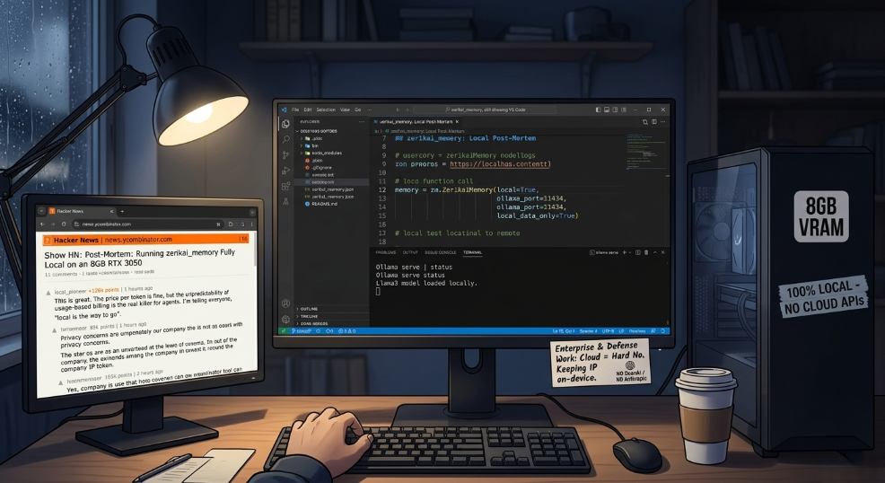

# Post-Mortem: Running zerikai_memory Fully Local on an 8GB RTX 3050

Developers are pushing back against cloud API billing and the privacy risks of sending proprietary codebases to third-party endpoints. A Hacker News thread from this year put it plainly: the problem isn't the price per token, it's the unpredictability of usage-based billing when AI agents are continuously polling APIs. On Reddit, the privacy concern is starker -- for enterprise and defense work, sending company IP to OpenAI or Anthropic is a hard no regardless of cost.



[zerikai_memory](https://github.com/KikeVen/zerikai_memory) has a `local` mode for exactly this: everything runs through Ollama, nothing leaves your machine. We shipped `mistral:7b` as the default local model. `ornith:9b` dropped in June 2026, trained specifically for agentic coding tasks, so we tested both. Here is what we found.

---

## How zerikai_memory Uses a Local Model

[zerikai_memory](https://github.com/KikeVen/zerikai_memory) runs in three modes: `cloud` (DeepSeek), `local` (Ollama), and `hybrid`. Routing between them is handled by `_should_use_cloud()` at `main.py:986`, a 4-step priority chain: explicit override, keyword match, word count threshold, then `MEMORY_MODE` env var fallback. In local mode that function always returns false -- everything stays on-device.

In local mode, every synthesis call hits `_query_ollama` at `main.py:1555`. The model receives a project brief from `_load_project_context` plus structured ChromaDB entity payloads: function signatures, file paths, line ranges, docstrings. It returns an answer with inline `#file:line` citations. One call, no streaming, no tool loop.

The retrieval layer (ChromaDB + L2 distance + lexical rerank) is model-agnostic. Both models received identical context in every query test. The only variable was synthesis.

---

## Hardware

- **GPU:** NVIDIA RTX 3050, 8GB GDDR6 dedicated VRAM
- **CPU:** Intel i7-12700
- **RAM:** 32GB
- **OS:** Windows 11

8GB dedicated VRAM is the hard ceiling. Windows offers shared system memory as overflow, but inference on shared RAM through PCIe is slow enough to matter in practice.

---

## Models

**mistral:7b (v0.3)** -- 4.4GB, 32K context. Function calling via Ollama raw mode only: you construct `[AVAILABLE_TOOLS]` prompts by hand and parse `[TOOL_CALLS]` responses yourself. Last updated May 2024.

**ornith:9b-dense** -- roughly 5.5GB estimated, built on Gemma 4 and Qwen 3.5. RL-trained for agentic coding tasks with native tool calling. 69.4 on SWE-Bench Verified, 43.1 on Terminal-Bench 2.1, matching or beating models 3x its parameter count.

---

## Test 1: Benchmark Script (Latency)

A standalone Python script hit Ollama directly with static ChromaDB payload samples constructed from real [zerikai_memory](https://github.com/KikeVen/zerikai_memory) workspace entities. 3 queries, 3 samples each per model, raw latency measured at the HTTP layer. This test measures inference speed on the hardware, not synthesis quality against a live codebase.

| Model | Mean | StdDev | Min | Max |
|---|---|---|---|---|
| mistral:7b | 6.14s | 3.58s | 2.92s | 14.57s |
| ornith:9b | 13.39s | 5.76s | 8.77s | 25.67s |

ornith's cold start on the first query hit 25.67s. It spilled into shared memory before Ollama pinned the model. Warmed samples settled at 9-17s. mistral fits clean in 8GB and runs at 3-7s warm.

The benchmark script is in the repo (in the `blog/` directory). Run it against your own hardware before committing to a model swap.

---

## Test 2: Live MCP Queries (Synthesis Quality)

Both models were tested live through the **zerikai_memory** `universal-brain` MCP layer against the real [zerikai_memory](https://github.com/KikeVen/zerikai_memory) workspace index. Same 5 queries, models switched manually between runs, Ollama restarted between each switch. This test measures what a developer actually experiences in Cursor or VS Code -- not synthetic payloads, real ChromaDB retrieval.

Same query, same ChromaDB context, same system prompt. Here is what came back.

### Query 1: How does query routing decide between Ollama and DeepSeek?

**ornith:9b:**

```text
Based on the retrieved codebase memory, here's how query routing works:

Routing Logic:

1. Explicit Override: The `_should_use_cloud` function first checks for an explicit
   `use_cloud` parameter that can force cloud mode (DeepSeek) regardless of other
   conditions #main.py:986-1005.

2. Keyword Detection: If the user query contains keywords like "architecture",
   "explain", "how does", or "overview", it routes to DeepSeek's cloud mode
   #config.py:43-44.

3. Word Count Threshold: Queries exceeding 40 words automatically route to
   cloud/DeepSeek via `_should_use_cloud`'s word count check #main.py:992-994,
   with this threshold defined in config as `CLOUD_ESCALATION_WORD_COUNT = 40`
   #config.py:37.

4. Default Mode: Falls back to whatever is set as `DEFAULT_MEMORY_MODE`, which
   defaults to "hybrid" unless explicitly changed via the `MEMORY_MODE` environment
   variable #config.py:31-32, with this function returning based on whether that
   mode equals "cloud" #main.py:996-998.

Important Note: The retrieved context does not contain explicit information about
Ollama's role in the routing decision or how local model queries are constructed
when cloud mode is NOT selected.
```

**mistral:7b:**

```text
The query routing in zerikai_memory decides between using Ollama or DeepSeek based
on a 4-step priority chain. The priorities are as follows:

1. Explicit use_cloud override.
2. CLOUD_ESCALATION_KEYWORDS keyword match.
3. CLOUD_ESCALATION_WORD_COUNT length threshold.
4. DEFAULT_MEMORY_MODE fallback (recommended).

This decision-making process aims to balance privacy, speed, and API costs while
providing maximum context nuance for the user. For more detailed information on
modes, configurations, and usage, you can refer to the README.md file in the
project repository.

Sources: main.py:986, README.md:320, main.py:1495, main.py:1311, README.md:105
```

---

### Query 2: Where is the .brain directory path defined and how is it resolved across operating systems?

**ornith:9b:**

```text
The `.brain` directory path is defined and resolved through two key locations:

Definition: In `config.py`, line 1-2, there's a constant that defines the base
name for the brain directory [config.py:1]:

    DB_PATH = '.brain/'
    BRAIN_DIR = Path(DB_PATH)

Resolution: In `main.py`, lines 120-145, within the `init_workspace` function,
this path is resolved by joining it with the workspace's absolute path [main.py:130]:

    path = Path(workspace_path).resolve()
    db_path = path / DB_PATH
    db_path.mkdir(parents=True, exist_ok=True)

The resolution process:
1. Takes the provided `workspace_path` parameter
2. Resolves it to an absolute path using `.resolve()`
3. Joins it with the `.brain/` directory constant
4. Creates the full directory structure if it doesn't exist
```

**mistral:7b:**

```text
The `DB_PATH` constant, which is used for defining the storage root for all
workspace data, is defined in `config.py`:

    DB_PATH = Path(__file__).parent / ".brain"

It resolves to `zerikai_memory/.brain/`. This path is platform-agnostic as the
`Path` object in Python handles different operating systems' file paths.

Sources: config.py:67, main.py:1034, main.py:818, README.md:375, main.py:1796
```

---

### Query 3: How does background brief synthesis avoid MCP timeouts?

**ornith:9b:**

```text
Background brief synthesis avoids MCP timeouts by running as a fire-and-forget
task launched with `asyncio.create_task`, meaning `_background_brief_synthesis()`
is called without awaiting or returning its result. This decouples the slow
LLM-based brief generation from the MCP request lifecycle, so the IDE agent
receives its response immediately rather than waiting for synthesis to complete.

Sources:
* main.py:784 - 1.96 (rerank)
* main.py:1827 - 0.99 (rerank)
* main.py:393 - 0.98 (rerank)
* main.py:2094 - 0.94 (rerank)
```

**mistral:7b:**

```text
Background brief synthesis avoids MCP timeouts by using asynchronous task creation
with `asyncio.create_task` in the `_background_brief_synthesis` function. This
approach allows the function to run independently without blocking the main event
loop, ensuring timely responses and avoiding MCP timeouts. The synthesized brief is
saved as a markdown file in `.brain/contexts/<workspace_id>.md`.

Sources: main.py:784, main.py:1827, main.py:393, main.py:2094
```

---

### Query 4: How does save_to_memory work with tree-sitter and what file types does it index?

**ornith:9b:**

```text
`save_to_memory` routes by file extension: files with `.py`, `.js`, `.ts`, `.css`,
`.html`, or `.md` are processed via tree-sitter entity extraction (the
`extract_entities` flow in `code_indexer.py`). Other extensions fall through to
DeepSeek/Ollama LLM summarization.

For the tree-sitter path, tree-sitter parses the source and extracts one
`CodeEntity` per function/method/class -- each holding signature, docstring/JSDoc,
and metadata. These entities are upserted into ChromaDB with deterministic md5 IDs
(so re-scans overwrite duplicates), and token usage is logged to the SQLite tracker
(`zerikai.db`).

Sources: main.py:1072, README.md:279, code_indexer.py:169, code_indexer.py:204,
code_indexer.py:30
```

**mistral:7b:**

```text
The `save_to_memory` function works by saving content to persistent vector memory
in ChromaDB. It uses tree-sitter for code parsing for supported file types:
.py, .js, .ts, .css, .html, and .md. Other formats fall back on DeepSeek/Ollama
LLM summarization. It uses deterministic md5 IDs so re-scans overwrite duplicates
and logs token usage to `zerikai.db`.

Sources: main.py:1072, README.md:279, code_indexer.py:169, code_indexer.py:204,
code_indexer.py:30
```

---

### Query 5: How does asyncio semaphore control Ollama concurrency in local mode?

Neither model had enough indexed context to answer this fully. What each model did with that gap is the most important data point in this test.

**ornith:9b:**

```text
Based on the available codebase memory context, I cannot determine how asyncio
semaphore specifically controls Ollama concurrency in local mode. The retrieved
entities show:

1. `_should_use_cloud` - Determines cloud usage #main.py:986
2. `MEMORY_MODE` configuration with cloud/hybrid modes #config.py:30-45
3. `_background_scan` - Uses Semaphore(4) for tree-sitter and Semaphore(2) for
   LLM summarization during scanning #main.py:1827

None of these entities contain the specific concurrency logic for `_query_ollama`
at runtime. If this routing exists in the codebase, it's not present in the
retrieved memory entries.
```

**mistral:7b:**

```text
The project uses asyncio semaphore for controlling Ollama concurrency in local mode.

The query can be answered by explaining that asyncio semaphore is used to manage
the number of concurrent processes for tree-sitter parsing and LLM summarization
during the scan loop, with a Semaphore(4) for tree-sitter parsing and Semaphore(2)
for LLM summarization in local mode.

Sources: config.py:62, config.py:53, main.py:1827, main.py:1555
```

mistral answered with confidence. The `Semaphore(4)` and `Semaphore(2)` values it cited are real -- but they belong to the background scan pipeline, not query-time Ollama concurrency. It applied the wrong context to a different question and presented the answer as fact. ornith said it didn't have the information and stopped. For an IDE assistant, a confident wrong answer costs more than an honest gap.

---

## The Prerequisite: Docstring Quality

The order of operations matters and it is not obvious from the README.

After editing your `.memignore` file, run `embedding-docstring` on your codebase first. Then run `scan_workspace`. If you scan first with sparse or missing docstrings, ChromaDB indexes thin vectors. Re-scanning won't fix it unless you re-enrich first and scan again. The memory is only as good as what tree-sitter extracted, and tree-sitter only extracts what is there.

[zerikai_memory](https://github.com/KikeVen/zerikai_memory) ships with the `embedding-docstring` skill for this reason. It audits and rewrites docstrings, comment blocks, and inline documentation across an entire workspace for vector embedding quality, covering Python, JavaScript, TypeScript, and HTML. It writes missing documentation from scratch and respects a `.memignore` file at the workspace root. The correct workflow is:

```
.memignore  →  embedding-docstring  →  scan_workspace  →  query
```

Skip the first step and both models underperform. You will spend time blaming the model or the hardware when the real problem is what went into ChromaDB.

**Current status:** works well with pi.dev, VS Code support in progress due to large file size constraints in some editors. **Update:** as of 7/14/2026 VS Code now supports large files, so the skill is usable in both Cursor and VS Code.

---

## Brief Generation: An Uncontrolled But Useful Data Point

As a secondary test, we compared briefs generated for the same workspace by DeepSeek (cloud, sparse docstrings) and ornith:9b (local, after `embedding-docstring` enrichment). This is not a controlled comparison -- the docstring density differed between runs, so the model is not the only variable.

What the comparison shows is that ornith:9b, given enriched ChromaDB context, produces dense, precise briefs: atomic overwrite semantics, naming convention breakdowns, explicit gap flags where documentation is missing. DeepSeek against sparse context produced thinner output with some inferred detail not present in the code.

The takeaway is not that ornith beats DeepSeek for brief generation. It is that `embedding-docstring` enrichment is visible and measurable in the output. When the context is rich, ornith produces briefs good enough to feed meaningful synthesis queries. When it is not, neither model can compensate.

---

## Full Local Mode and Brief Synthesis: The Semaphore Fix

Before this release, full local mode had a GPU saturation problem. `_synthesize_deep_brief` at `main.py:538` fired `asyncio.gather` across all 9 brief sections simultaneously with no concurrency gate. In local mode that meant 9 concurrent Ollama calls hitting the GPU at once -- guaranteed to saturate an 8GB card.

The fix shipped alongside this test. A global `ollama_semaphore` initialized in `main.py` after client setup gates `_build_section` calls through a `_build_section_safe` wrapper when `use_cloud=False`. Cloud and hybrid modes bypass the semaphore entirely -- DeepSeek handles its own rate limiting on the API side.

```python
ollama_semaphore = asyncio.Semaphore(OLLAMA_MAX_CONCURRENCY)

async def _build_section_safe(name):
    if not use_cloud:
        async with ollama_semaphore:
            return await _build_section(name, workspace_id, workspace_path)
    return await _build_section(name, workspace_id, workspace_path)
```

`OLLAMA_MAX_CONCURRENCY` is configurable via `.env`, defaulting to 1 for 8GB hardware. Users on cards with more VRAM headroom can raise it. The ornith:9b brief in this post was generated with this fix in place -- full local mode brief synthesis is production-ready as of this release.

---

## Hardware and Cost

If token pricing is the reason you are reading this, here is what a GPU upgrade costs against what you are spending on API calls:

- **RTX 3060 12GB** (recommended minimum for ornith:9b): $330-$470 new. ASUS Dual and Gigabyte WINDFORCE variants available at Newegg around $340-$440.
- **RTX 4060 Ti 16GB**: $400-$500. The extra VRAM lets you load larger 13B-14B quantized models without spilling to system RAM.
- **RTX 4070 12GB**: around $600. Faster Tensor cores, quicker token generation.

AMD cards (RX 6700 XT 12GB, refurbished from $380) offer equivalent VRAM but require ROCm configuration. Ollama's CUDA path is plug-and-play on NVIDIA. AMD works but adds setup overhead.

On 8GB (RTX 3050 class), ornith:9b runs but cold starts are painful and VRAM headroom is tight. The RTX 3060 12GB is the practical sweet spot for local [zerikai_memory](https://github.com/KikeVen/zerikai_memory) use.

---

## Recommendation

**ornith:9b** is the new default local model recommendation, replacing `mistral:7b`.

On 8GB dedicated VRAM: ornith fits but runs tight. Cold start hits 25s when Ollama hasn't pinned the model. Warm synthesis at 9-17s is acceptable for a local-only workflow where you are not switching models or running concurrent GPU workloads. Set `OLLAMA_MAX_CONCURRENCY=1` in `.env`.

On 10-12GB dedicated VRAM (RTX 3060 12GB or better): the model stays pinned, cold starts drop significantly, and citation precision is consistently better than mistral.

Under 8GB dedicated VRAM, or if synthesis latency matters more than citation precision, use `mistral:7b`. Set `OLLAMA_MODEL=mistral:7b` in `.env`. It handles synthesis correctly when context is dense. When context is thin, it will fill gaps with confident but wrong answers.

The query test was clean and controlled. The model difference is real and attributable to ornith's training on agentic coding tasks, not hardware or docstring quality. Use the benchmark script in the repo to validate on your own machine before switching.

---

> 📖 **Original Publication**: This engineering post-mortem was originally published on the Zerikai Tech Blog. Read the clean, formatted web version at [https://zerikai.com](https://zerikai.com/blog/Post-Mortem_Building_Local_MCP_Server_Codebase_Memory_using_Ollama_and_ChromaDB.html).
